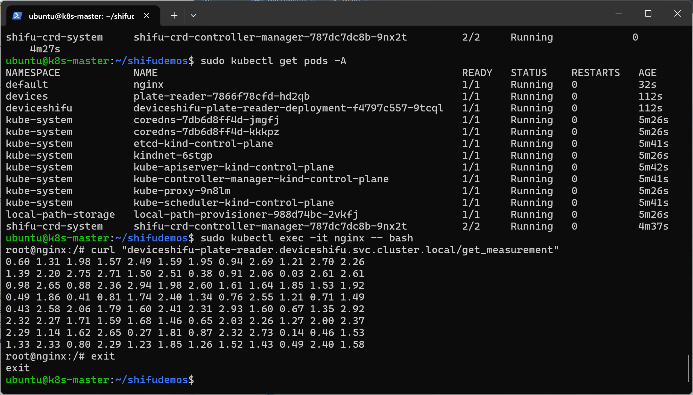
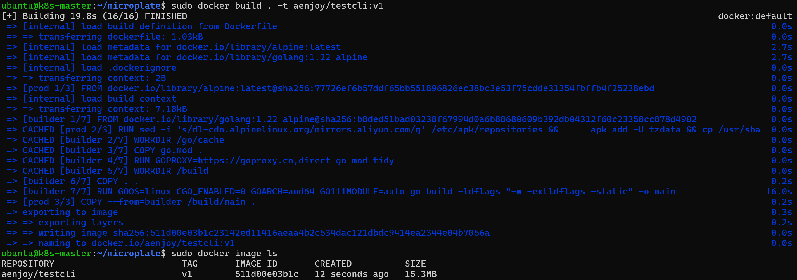
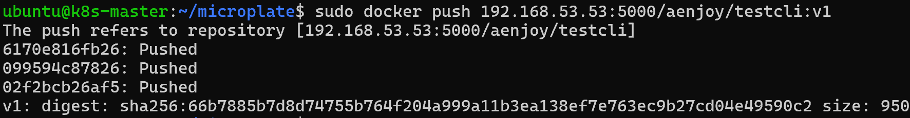

# 任务说明

【具体任务】

1. 请参考以下指南，部署并运行Shifu：https://shifu.dev/docs/tutorials/demo-install/

2. 运行一个酶标仪的数字孪生：https://shifu.dev/docs/tutorials/demo-try/#3-interact-with-the-microplate-reader

## v1 版代码 git-18ff278 docker运行测试

![running-on-k8s]