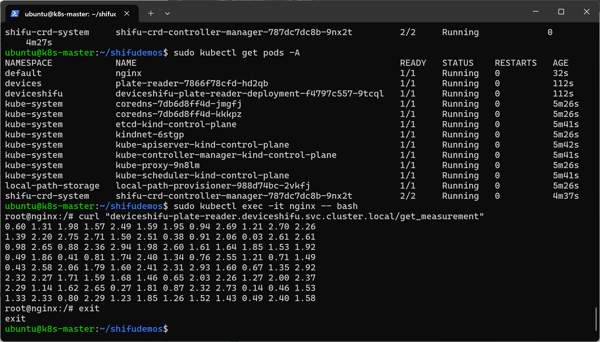

# 任务说明

# 任务1

1. 请参考以下指南，部署并运行Shifu：https://shifu.dev/docs/tutorials/demo-install/

# 任务2

 2. 运行一个酶标仪的数字孪生：https://shifu.dev/docs/tutorials/demo-try/#3-interact-with-the-microplate-reader

任务1与任务2的截图如下：



# 任务3

3.编写一个Go应用

    3.1 定期轮询获取酶标仪的/get_measurement接口，并将返回值平均后打印出来，轮询时间可自定义
    3.2 Go的应用需要容器化
    3.3 Go的应用需要运行在Shifu的k8s集群当中
    3.4 最终通过kubectl logs命令可以查看打印的值

## v1 版代码至v3版代码主要用于测试和环境搭建

环境搭建测试：容器构建，推送至仓库


假设我们已经修改了/etc/hosts文件 增加了如下内容：

- 192.168.53.53 registry.iotroom.top

同时，在192.168.53.53的nginx配置文件中，我们增加了如下反代：

```
server{
        listen 443 quic;
        listen [::]:443 quic;
        listen 443 ssl;
        listen [::]:443 ssl;
        server_name registry.iotroom.top;
        location /{
            add_header Alt-Svc 'h3=":443"; ma=2592000,h3-29=":443"; ma=2592000,h3-Q050=":443"; ma=2592000,h3-Q046=":443"; ma=2592000,h3-Q043=":443"; ma=2592000,quic=":443"; ma=2592000; v="46,43"';
            proxy_pass  http://127.0.0.1:5000;
            proxy_redirect off;
            proxy_buffering off;
            proxy_set_header        Host            $host;
            proxy_set_header        X-Real-IP       $remote_addr;
            proxy_set_header        X-Forwarded-For $proxy_add_x_forwarded_for;
        }
}
```

此外，在192.168.53.53上我们还安装了registry，用于存储镜像。

## v4 版代码 git-1764609

```shell
git clone https://git.iotroom.top/aenjoy/microplate
cd microplate
sudo docker build . -t aenjoy/microplate:v4 
sudo docker tag aenjoy/microplate:v4 192.168.53.53:5000/aenjoy/microplate:v4
sudo docker push 192.168.53.53:5000/aenjoy/microplate:v4
```

输出：
```
The push refers to repository [192.168.53.53:5000/aenjoy/microplate]
4cdec4ff659d: Pushed
5f70bf18a086: Pushed
9f4c48a24ca5: Pushed
a8a2007b3a96: Pushed
dbc78f895659: Pushed
ed5bf86b9959: Pushed
8845ab872c1c: Pushed
d7d4c2f9d26b: Pushed
bbe1a212f7e9: Pushed
v4: digest: sha256:f605372dd6afa967311ef98655d9b14c6c4825e04c34ed88c0644887a662c26f size: 2418
```

然后拉取镜像

```shell
sudo kubectl run --image=registry.iotroom.top/aenjoy/microplate:v4 microplatecliv4
```

任务3截图如下：

输出：


等待一会：


运行3.4命令：
```shell
sudo kubectl logs -f microplatecliv4
```

输出如下：


任务3完成。
